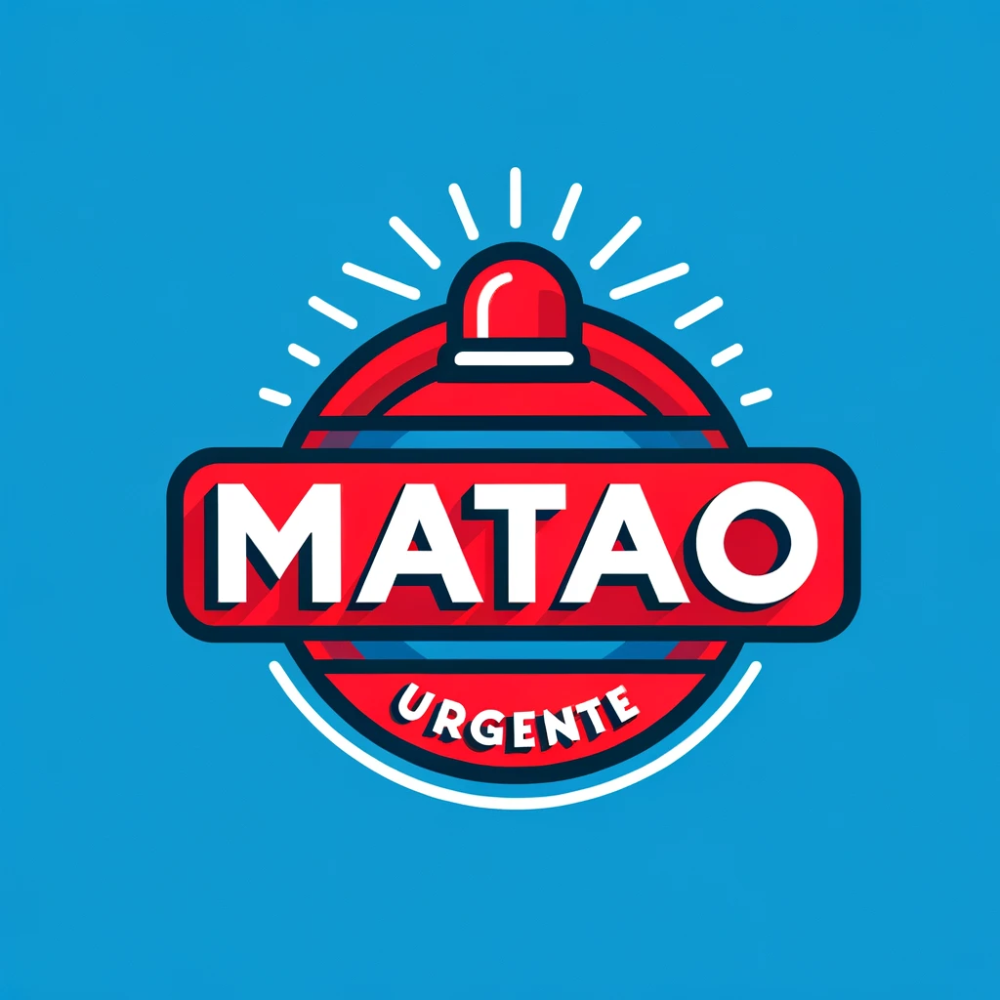

   

# Matão Urgente Bot

> Perfil (não oficial) onde compartilho as últimas notícias do https://site.mataourgente.com.br. Desenvolvido em Python usando a API do ChatGPT 4 🤖

> Você pode me encontrar em https://twitter.com/mataourgentebot.

---

## :pushpin: Table of Contents

> TO DO

## :rocket: Features

> TO DO

## :computer: Tools

- [Python](https://www.python.org), [OpenAI](https://pypi.org/project/openai/), [Tweepy](https://pypi.org/project/tweepy/), [BeautifulSoup](https://pypi.org/project/beautifulsoup4/), and [Requests](https://pypi.org/project/requests/).

## :construction_worker: Getting Started

> TO DO
    
## :closed_book: License

This project is under the [MIT license](https://github.com/gabrielhs1357/matao-urgente-bot/blob/main/LICENSE).

---

Made with 💜 by <a href='https://github.com/gabrielhs1357'>Gabriel Silva</a>.

